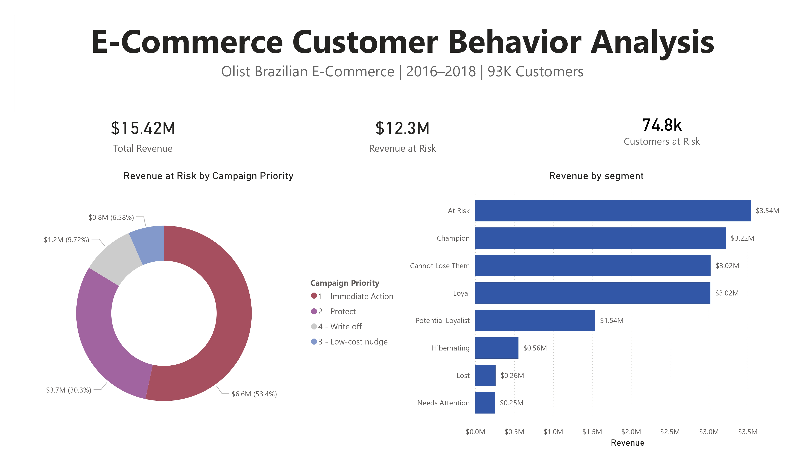
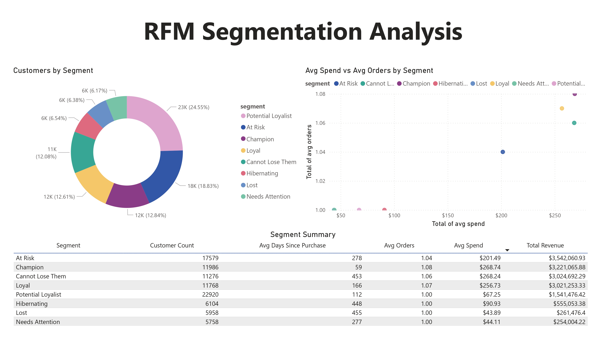
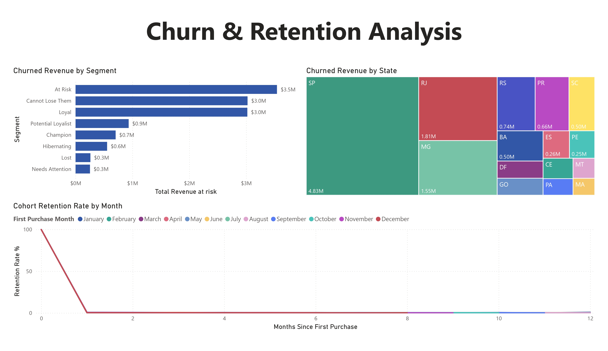

# E-Commerce Customer Behavior Analysis
### PostgreSQL · Power BI
**By Jasmine Unochi** · [LinkedIn](https://www.linkedin.com/in/jasmine-unochi-4613a3169) · [GitHub](https://github.com/unochifarah)

---

## Overview

This project analyzes customer behavior data from Olist, Brazil's largest e-commerce platform, using a real-world relational dataset of 8 tables and 500K+ transactions spanning 2016–2018. Using PostgreSQL and Power BI, I built an RFM segmentation model and churn prediction analysis to identify revenue at risk and surface actionable business recommendations.

---

## Tools Used

| Tool | Purpose |
|---|---|
| PostgreSQL | Data storage, schema design, exploration, RFM analysis, churn analysis |
| Power BI | Interactive 3-page dashboard |

---

## Business Questions Answered

- Which customers are most valuable, and how are they segmented by behavior?
- What percentage of customers have churned, and how much revenue is at risk?
- Which RFM segments should be prioritized for re-engagement campaigns?
- When do customers churn — and is it consistent across all cohorts?
- Which states have the highest concentration of churned revenue?
- What is the estimated revenue recovery potential from targeted campaigns?

---

## Key Findings

- **79.75% of total revenue ($12.3M out of $15.4M) is at risk** from churned customers
- **80.17% of customers churned** — 74,835 out of 93,349 unique customers never returned after 90 days
- **Month-1 retention is below 1% across all cohorts** — the churn problem is structural, not seasonal
- **At Risk segment has the highest churned revenue at $3.5M**, making it the #1 re-engagement target
- **Champion segment is the only protected group**, with just 21% churn vs ~100% for most other segments
- **São Paulo (SP) dominates churned revenue at $4.83M** — nearly 3x the second highest state (RJ at $1.81M)
- **A 20% re-engagement rate on At Risk + Cannot Lose Them** could recover an estimated $1.3M in revenue

---

## RFM Segmentation

Scored each customer 1–4 on Recency, Frequency, and Monetary dimensions using `NTILE(4)` window functions, then combined scores into 9 behavioral segments.

| Segment | Customers | Avg Days Since Purchase | Avg Spend | Total Revenue |
|---|---|---|---|---|
| At Risk | 17,579 | 278 | $201 | $3.54M |
| Potential Loyalist | 22,920 | 112 | $67 | $1.54M |
| Champion | 11,986 | 59 | $269 | $3.22M |
| Cannot Lose Them | 11,276 | 453 | $268 | $3.02M |
| Loyal | 11,768 | 166 | $257 | $3.02M |
| Hibernating | 6,104 | 448 | $91 | $0.56M |
| Lost | 5,958 | 455 | $44 | $0.26M |
| Needs Attention | 5,758 | 277 | $44 | $0.25M |

---

## Business Recommendations

| Priority | Segment | Action | Est. Recovery (20%) |
|---|---|---|---|
| 1 — Immediate | At Risk (17,579 customers) | Targeted discount + re-engagement email | $708K |
| 1 — Immediate | Cannot Lose Them (11,276 customers) | High-value personal outreach | $605K |
| 2 — Protect | Champion | VIP rewards, early access, loyalty perks | — |
| 3 — Convert | Potential Loyalist | Day-30 post-purchase follow-up email | — |
| 4 — Write off | Lost + Hibernating | Low-cost automated nudge only | — |

**Single highest-ROI intervention:** Implement an automated post-purchase email sequence triggered within 7 days of first delivery. Cohort data shows the entire churn problem concentrates at month 0→1 — a single well-timed touchpoint addresses the majority of customer loss.

---

## Power BI Dashboard

3-page interactive dashboard:

1. **Executive Summary** — total revenue, revenue at risk KPIs, campaign priority donut chart, revenue by segment bar chart
2. **RFM Segmentation** — customer distribution donut, avg spend vs avg orders scatter plot, full segment summary table
3. **Churn & Retention** — churned revenue by segment, geographic treemap by state, cohort retention line chart

### Dashboard Preview
> 
> 
> 

---

## SQL Concepts Showcased

- `WITH` (CTEs) — multi-step RFM calculation pipeline
- `NTILE()`, `RANK()`, `PARTITION BY` — window functions for scoring and ranking
- Multi-table `JOIN`s — across 8 relational tables
- `CASE WHEN` — segmentation and campaign priority logic
- `DATE_TRUNC` — cohort month bucketing
- `FILTER (WHERE ...)` — conditional aggregations for churn metrics
- Views and materialized tables for downstream analysis

---

## Repository Structure

```
ecommerce-customer-analytics/
  README.md
  data/
    rfm_segments.csv
    revenue_at_risk.csv
    churn_by_state.csv
    cohort_retention.csv
  phase1_schema.sql
  phase2_exploration_cleaning.sql
  phase3_rfm_segmentation.sql
  phase4_churn_analysis.sql
  olist_customer_analysis.pbix
```

---

## Dataset

**Source:** [Olist Brazilian E-Commerce Dataset](https://www.kaggle.com/datasets/olistbr/brazilian-ecommerce) via Kaggle  
**Records:** 500K+ transactions across 8 relational tables  
**Period:** 2016–2018  
**Fields:** Orders, Customers, Products, Sellers, Payments, Reviews, Geolocation
